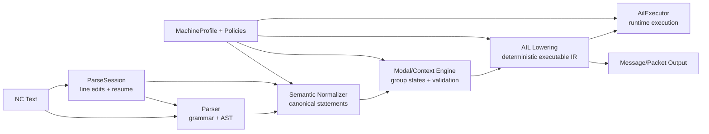
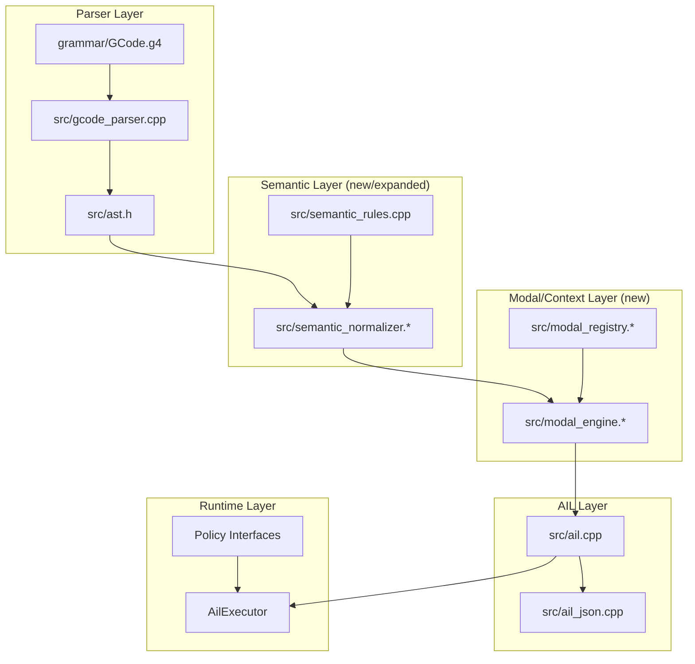
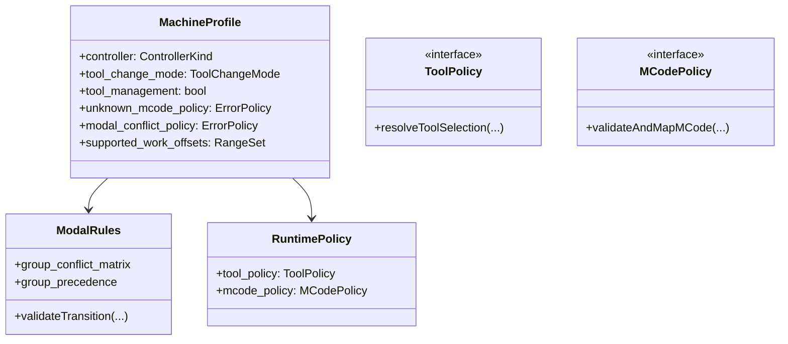
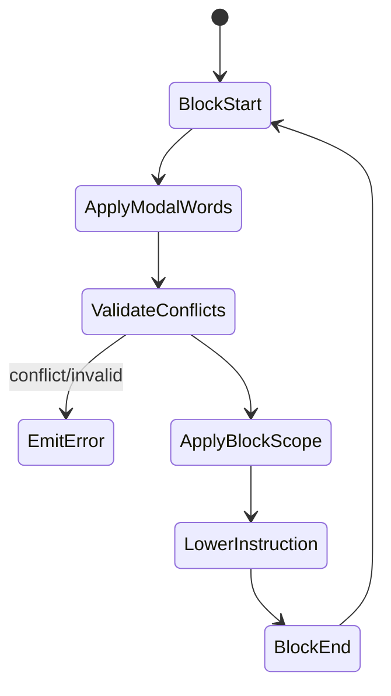

# ARCHITECTURE — Parser and Runtime Design (v1 Draft)

## 1. Purpose
This document defines how the codebase will be organized to satisfy the current
PRD requirements, with a Siemens-840D-compatible syntax model and
configuration-driven runtime semantics.

## 2. Confirmed v1 Decisions
- Siemens syntax compatibility: `Yes`
- Siemens runtime semantics: `Optional via profile/config`
- Baseline controller profile: `840D`
- Unknown M-code policy: `Error`
- Modal conflicts: `Error`
- Machine-related behavior: `Config-driven` (not hardcoded)

## 3. High-Level Pipeline

## 4. Code Organization (Target)

## 5. Config and Policy Model

## 6. Modal State Strategy
- Keep a single modal registry keyed by Siemens group IDs.
- Grouped state includes at minimum:
  - Group 1: motion type family (`G0/G1/G2/G3` as baseline in current scope)
  - Group 6: working-plane selection (`G17/G18/G19`)
  - Group 7: `G40/G41/G42`
  - Group 8: `G500/G54..G57/G505..G599`
  - Group 10: `G60/G64..G645`
  - Group 11: `G9` (block-scope)
  - Group 12: `G601/G602/G603`
  - Group 13: `G70/G71/G700/G710`
  - Group 14: `G90/G91`
  - Group 15: feed type family
- Related non-group/aux state (modeled alongside modal groups):
  - rapid interpolation control (`RTLION` / `RTLIOF`) affecting `G0` behavior
  - block-scope suppress contexts (`G53/G153/SUPA`)

## 6.1 Incremental Parse Session Strategy
- `ParseSession` owns editable source lines and cached lowering boundary metadata.
- Resume contract:
  - preserve immutable prefix before resume line
  - reparse + relower suffix from resume line
  - merge diagnostics/instructions/messages deterministically by 1-based line
- Resume entry points:
  - explicit line (`reparseFromLine(line)`)
  - first error (`reparseFromFirstError()`)
- v1 scope:
  - deterministic prefix/suffix merge semantics and API behavior
  - parser-internal tree-reuse optimization is a later performance enhancement

## 7. Parse vs Runtime Responsibility
- Parser layer:
  - recognizes syntax and preserves source form/location
  - does not hardcode machine-specific behaviors
- Semantic/modal layers:
  - resolve meaning under `MachineProfile`
  - enforce modal/conflict policies
- Runtime layer:
  - executes AIL with policy hooks
  - applies machine-specific actions (tool/mcode behavior)

## 8. Current Coverage Snapshot
- Implemented:
  - core `G1/G2/G3/G4` flow
  - control flow core (`goto`, `if_goto`, structured `if/else/endif` lowering)
  - line-number targeting runtime
- Partial:
  - `G0` rapid semantics
  - M-code semantics
  - comment compatibility extensions
- Detailed exact-stop/continuous-path architecture note:
  - [docs/src/design/exactstop_contpath_architecture.md](/home/liufang/optcnc/gcode/docs/src/design/exactstop_contpath_architecture.md)
- Detailed M-code architecture note:
  - [docs/src/design/mcode_architecture.md](/home/liufang/optcnc/gcode/docs/src/design/mcode_architecture.md)
- Detailed rapid-traverse architecture note:
  - [docs/src/design/rapid_traverse_architecture.md](/home/liufang/optcnc/gcode/docs/src/design/rapid_traverse_architecture.md)
- Planned:
  - modal groups 6/7/8/10/11/12/13/14/15 full state model
  - tool management behaviors
  - full feed/dimension/unit/work-offset integration

## 9. Implementation Sequence (High Level)
1. Build modal registry + machine profile skeleton.
2. Move existing modal logic into modal engine.
3. Introduce semantic normalizer output schema.
4. Add one feature family at a time (comments, M, groups, feed, dimensions).
5. Keep each slice test-first with `./dev/check.sh`.
