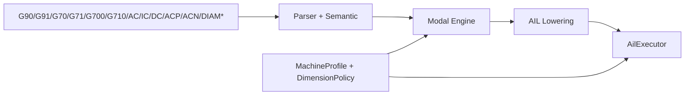
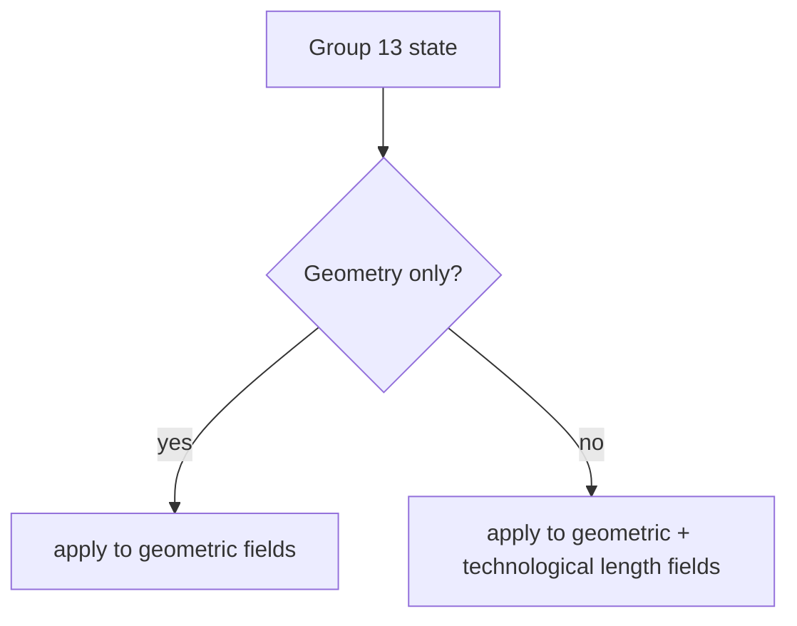

# Design: Dimensions and Units Model (Groups 13/14 + `AC/IC` + `DIAM*`)

Task: `T-042` (architecture/design)

## Goal

Define Siemens-compatible architecture for:
- Group 14 modal absolute/incremental state (`G90/G91`)
- Group 13 unit state (`G70/G71/G700/G710`)
- per-value absolute/incremental overrides (`AC`/`IC`)
- rotary absolute targeting (`DC/ACP/ACN`)
- turning diameter/radius programming family (`DIAM*`, `DAC/DIC/RAC/RIC`)

This design maps PRD Section 5.8.

## Scope

- state ownership and propagation through parse -> AIL -> runtime
- precedence rules for modal state vs per-value overrides
- model boundaries for units impacting geometry-only vs geometry+technology
- axis/channel policy hooks for turning diameter/radius semantics
- integration touchpoints with feed and plane/compensation states

Out of scope:
- full machine-data database implementation
- controller-specific cycle internals and kinematic solvers

## Pipeline Boundaries



- Parser/semantic:
  - parses modal words, overrides, and axis-value forms
  - validates grammar shape and impossible combinations in one block
- Modal engine:
  - holds Group 14 and Group 13 persistent state
  - resolves effective interpretation mode per value (modal + local override)
- AIL/executor:
  - carries normalized interpretation metadata for motion/assignment consumers

## State Model

Group 14 (modal distance interpretation):
- `g90`: absolute
- `g91`: incremental

Group 13 (modal units):
- `g70` / `g71`: geometry-only unit switch
- `g700` / `g710`: geometry + technological-length unit switch

Per-value overrides (non-modal value decorators):
- `AC(...)`: force absolute for the decorated value
- `IC(...)`: force incremental for the decorated value

Rotary absolute targeting (non-modal):
- `DC(...)`: shortest-path absolute rotary target
- `ACP(...)`: positive-direction absolute rotary target
- `ACN(...)`: negative-direction absolute rotary target

Turning diameter/radius family:
- channel/axis mode words (`DIAMON`, `DIAMOF`, `DIAM90`, `DIAMCYCOF`)
- axis-value forms (`DAC(...)`, `DIC(...)`, `RAC(...)`, `RIC(...)`)

## Precedence Rules

1. Effective value interpretation starts from modal Group 14.
2. If a value has `AC`/`IC`, that local override wins for that value only.
3. `DC/ACP/ACN` apply only to rotary-target forms and do not modify Group 14.
4. Diameter/radius forms apply only on profile-eligible axes.
5. Unit interpretation applies before runtime feed/planner consumption, with
   Group 13 scope deciding which quantities are unit-switched.

## Unit Scope Model

- `G70/G71`:
  - affects geometry quantities (positions, arc data, pitch, programmable zero
    offset geometry terms, polar radius)
  - does not directly switch technological feed-length interpretation
- `G700/G710`:
  - affects geometry quantities plus technological-length quantities
  - must couple with feed model consumers



## Axis/Channel Policy Hooks

Machine/profile configuration should provide:
- axis eligibility for diameter/radius semantics
- channel turning-mode defaults
- rotary-axis targeting constraints for `DC/ACP/ACN`
- conflict behavior policy for mixed incompatible decorators in one block

Invalid policy cases (examples):
- `DAC(...)` on non-turning axis -> diagnostic and ignore value
- incompatible rotary decorators in same value -> diagnostic

## Integration Points

- Feed model (`T-041`):
  - Group 13 broad-unit mode (`G700/G710`) influences feed-length semantics
- Working plane (`T-040`) and tool compensation (`T-039`):
  - axis/plane interpretation of center and compensated paths consumes
    effective dimension interpretation metadata
- Work offsets (`T-043`):
  - coordinate-frame selection/suppression occurs independently from
    absolute/incremental and units interpretation, then composes in runtime

## Output Schema Expectations

AIL modal-state concept:

```json
{
  "kind": "dimension_state",
  "group14_mode": "g90",
  "group13_mode": "g710",
  "source": {"line": 80}
}
```

Value-level effective interpretation concept:

```json
{
  "axis": "X",
  "effective_distance_mode": "incremental",
  "mode_source": "local_ic",
  "effective_unit_scope": "geometry_and_technology"
}
```

Rotary targeting concept:

```json
{
  "axis": "C",
  "target_mode": "absolute_positive_direction",
  "source_decorator": "ACP"
}
```

## Policy Interface Sketch

```cpp
struct DimensionPolicy {
  virtual EffectiveDimension resolve(const ModalState& modal,
                                     const ValueContext& value,
                                     const RuntimeContext& ctx,
                                     const MachineProfile& profile) const = 0;
};
```

## Implementation Slices (follow-up)

1. Modal-state completion
- finalize Group 13/14 representation and transition handling

2. Value-override lowering
- normalize `AC/IC` and rotary decorators into explicit value metadata

3. Diameter/radius policy wiring
- enforce axis eligibility and emit deterministic diagnostics

4. Feed/plane coupling
- integrate unit-scope effects with feed and plane consumers

## Test Matrix (implementation PRs)

- parser tests:
  - valid/invalid Group 13/14 transitions and decorator syntax
- modal-engine tests:
  - Group 14 persistence + per-value override precedence
  - Group 13 scope behavior contracts
- AIL/executor tests:
  - stable effective metadata for distance/unit/rotary modes
  - diameter/radius policy diagnostics by axis eligibility
- docs/spec sync:
  - update SPEC sections for dimensions/units/turning semantics per slice

## Traceability

- PRD: Section 5.8 (dimensions, units, rotary targeting, DIAM*)
- Backlog: `T-042`
- Coupled tasks: `T-041` (feed), `T-039` (comp), `T-040` (plane), `T-043` (offsets)
