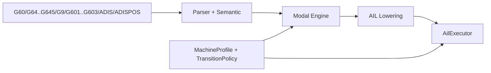
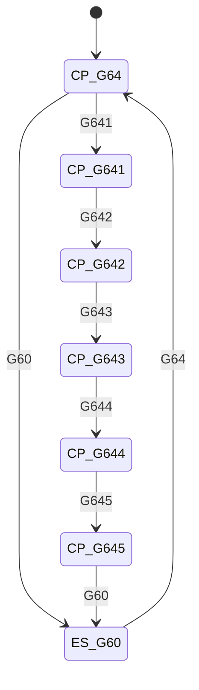
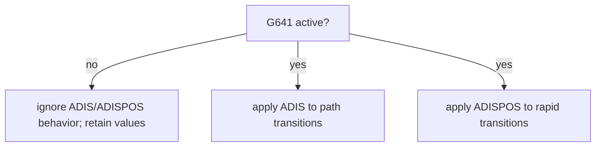

# Design: Exact-Stop and Continuous-Path Modes (Groups 10/11/12)

Task: `T-044` (architecture/design)

## Goal

Define Siemens-compatible architecture for transition control modes:
- Group 10: exact-stop vs continuous-path (`G60`, `G64..G645`)
- Group 11: non-modal exact-stop (`G9`)
- Group 12: exact-stop block-change criteria (`G601/G602/G603`)
- `G641` coupling with `ADIS` / `ADISPOS`

This design maps PRD Section 5.10.

## Scope

- modal/non-modal state model and precedence rules
- criterion applicability rules for Group 12 under exact-stop
- representation and semantics of `ADIS`/`ADISPOS` with `G641`
- interaction points with feed and motion execution layers
- output schema expectations for transition mode metadata

Out of scope:
- servo control-law internals and real controller lookahead implementation
- machine-vendor trajectory kernel details

## Pipeline Boundaries



- Parser/semantic:
  - parses mode words and validates value forms
- Modal engine:
  - resolves active Group 10 mode, Group 11 block-scope flag, Group 12 criterion
  - validates cross-group applicability
- AIL/executor:
  - carries transition-state metadata and applies runtime behavior boundaries

## Group State Model

Group 10 (modal):
- `G60` exact-stop mode
- `G64`, `G641`, `G642`, `G643`, `G644`, `G645` continuous-path family

Group 11 (non-modal):
- `G9` exact-stop for current block only

Group 12 (modal criterion):
- `G601` exact-stop fine
- `G602` exact-stop coarse
- `G603` IPO end

Auxiliary parameters:
- `ADIS=<value>` (path transitions, usually G1/G2/G3 path moves with `G641`)
- `ADISPOS=<value>` (positioning/rapid transitions, `G0` with `G641`)



## Precedence and Applicability Rules

1. Group 11 (`G9`) is block-local and has highest effect for that block.
2. Otherwise Group 10 modal state defines transition behavior.
3. Group 12 criterion is meaningful only when effective exact-stop is active
   (`G60` modal or `G9` current block).
4. Under continuous-path effective mode, Group 12 is retained as modal state but
   not applied for block-change timing decisions.

Applicability matrix:
- `G60` + (`G601|G602|G603`) => criterion applied
- `G9` + (`G601|G602|G603`) => criterion applied in current block
- `G64..G645` + (`G601|G602|G603`) => criterion inactive (stored, not used)

## `G641` + `ADIS`/`ADISPOS` Coupling

Rules:
- `ADIS` and `ADISPOS` are only behavior-relevant when effective Group 10 mode
  is `G641`.
- if omitted, default value is `0` (profile default may override)
- `ADIS` targets path transitions; `ADISPOS` targets positioning (`G0`) moves

Validation:
- negative values are invalid
- parser reports clear diagnostics for malformed assignments



## Runtime Boundary and Output Semantics

AIL transition instruction concept:

```json
{
  "kind": "transition_mode",
  "group10_mode": "g641",
  "group11_block_exact_stop": false,
  "group12_criterion": "g602",
  "adis": 0.5,
  "adispos": 0.0,
  "source": {"line": 30}
}
```

Runtime effective-state concept per executed block:

```json
{
  "effective_transition_mode": "exact_stop",
  "effective_source": "group11_g9",
  "effective_criterion": "g601",
  "smoothing_mode": "none"
}
```

Notes:
- packet/motion outputs should carry effective transition metadata as needed by
  downstream planner, without embedding full servo behavior.

## Interaction Points

- Feed model (Group 15):
  - effective transition mode may reduce/shape path velocity at boundaries
- Rapid traverse model (`T-045`):
  - Group 10 state can constrain effective rapid interpolation behavior
- Compensation/transform states:
  - can affect whether smoothing/transition elements are allowed

## Machine Profile / Policy Hooks

Suggested profile fields:
- `default_group10_mode` (e.g., `g64`)
- `default_group12_criterion` (e.g., `g602`)
- `adis_default`, `adispos_default`
- `supports_g644_with_transform` (bool; false -> policy fallback to `g642`)

Policy interface sketch:

```cpp
struct TransitionPolicy {
  virtual EffectiveTransition resolve(const ModalState& modal,
                                      const BlockContext& block,
                                      const RuntimeContext& ctx,
                                      const MachineProfile& profile) const = 0;
};
```

## Implementation Slices (follow-up)

1. Modal registry/state completion
- ensure Groups 10/11/12 are fully represented with scope semantics

2. Parser/semantic validation
- robust parsing and validation for `ADIS`/`ADISPOS`
- criterion applicability diagnostics/policy notes

3. AIL/runtime effective state
- emit and consume transition metadata for each block
- implement Group 11 block-scope override behavior

4. Integration coupling
- connect transition state to rapid/feed behaviors via policy boundaries

## Test Matrix (implementation PRs)

- parser tests:
  - syntax/validation for Group 10/11/12 and `ADIS`/`ADISPOS`
- modal-engine tests:
  - block-local `G9` override behavior
  - Group 12 applicability under exact-stop only
- AIL/executor tests:
  - effective mode resolution per block
  - criterion and smoothing metadata stability
- docs/spec sync:
  - update SPEC/program reference as each slice lands

## Traceability

- PRD: Section 5.10 (exact-stop and continuous-path modes)
- Backlog: `T-044`
- Coupled tasks: `T-045` (rapid traverse), `T-041` (feed model)
