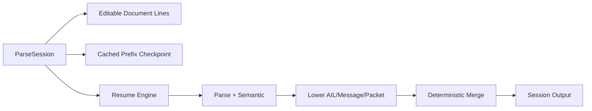
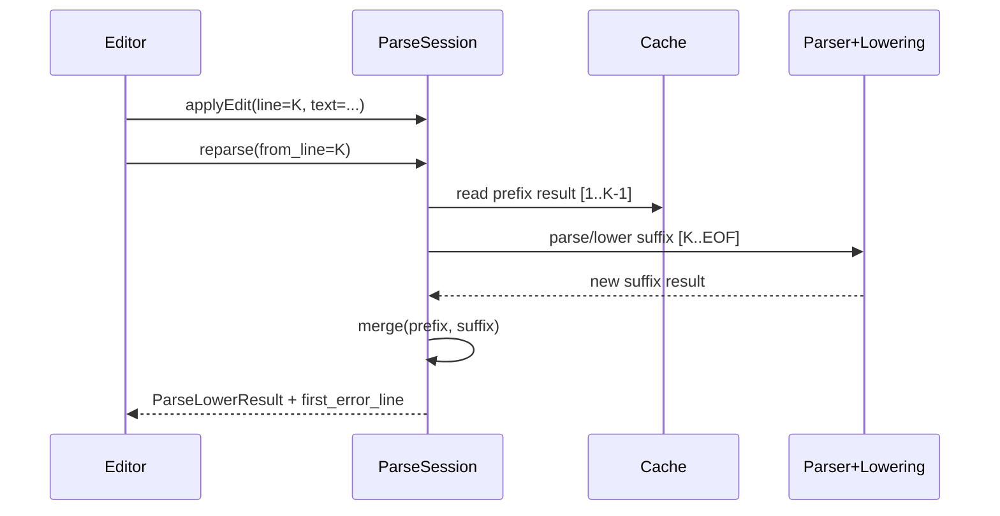

# Design: Incremental Parse Session API

Task: `T-047` (architecture/design)

## Goal

Define a deterministic session API for editor-style NC line edits where parsing
can resume from an explicit line or the first error line without rebuilding
unchanged prefix results.

## Scope

- API contract for line-based edits and resume controls
- deterministic prefix/suffix merge rules for diagnostics and outputs
- fail-fast behavior and first-error-line discovery
- compatibility with text-backed and file-backed workflows

Out of scope:
- parser-internal parse-tree reuse optimization
- LSP/editor protocol transport details

## Session Model



Core invariants:
- Line numbering is 1-based and stable for unchanged lines.
- Prefix lines before resume boundary are immutable in this parse cycle.
- Suffix lines from boundary to EOF are fully recomputed.
- Output ordering is always by source line and in-line statement order.

## API Contract (Design)

```cpp
struct SessionEdit {
  enum class Kind { ReplaceLine, InsertLine, DeleteLine };
  Kind kind;
  std::size_t line;      // 1-based target line
  std::string text;      // used by Replace/Insert
};

struct ResumeOptions {
  std::optional<std::size_t> from_line; // explicit resume boundary
  bool from_first_error = false;        // fallback boundary selector
  bool fail_fast = true;                // stop parse at first hard error
};

class ParseSession {
public:
  void setText(std::string full_text);
  void setFile(std::string path);
  void applyEdit(const SessionEdit& edit);
  void applyEdits(std::span<const SessionEdit> edits);

  ParseLowerResult reparse(const ResumeOptions& options);
  std::optional<std::size_t> firstErrorLine() const;
};
```

Behavior notes:
- If both `from_line` and `from_first_error` are set, explicit `from_line`
  wins.
- If `from_first_error=true` and no prior error exists, boundary is line 1.
- Invalid boundary (`0` or greater than `line_count + 1`) returns diagnostic
  error and does not mutate cached outputs.

## Merge Semantics

Boundary `B`:
- prefix: lines `[1, B-1]` (reused from cache)
- suffix: lines `[B, EOF]` (reparsed/re-lowered)

Merging:
- `diagnostics`: keep prefix diagnostics with `line < B`; replace all
  diagnostics with `line >= B` by freshly computed suffix diagnostics.
- `instructions/messages/packets`: same rule as diagnostics; deterministic sort
  key is `(line, statement_index, instruction_index)`.
- `rejected_lines`: suffix entries fully replaced from `B`.



## Fail-Fast and Error Recovery

- `fail_fast=true`:
  - parser stops at first hard syntax/semantic error in suffix
  - `first_error_line` is updated to that line
  - prefix outputs remain valid and reusable
- `fail_fast=false`:
  - parser continues collecting errors in suffix
  - `first_error_line` remains earliest suffix hard error

Recommended editor loop:
1. parse with `fail_fast=true`
2. user fixes `first_error_line`
3. call `reparse(from_line=fixed_line)`

## File-backed and Text-backed Modes

- `setText(...)`: in-memory source of truth
- `setFile(path)`: session loads file content into line buffer and then behaves
  identically to text-backed mode
- Editing is always line-buffer based; file mode is not incremental I/O mode

## Test Plan Slices (follow-up implementation tasks)

1. `ParseSessionApiTest`:
   - invalid boundary handling
   - explicit boundary precedence over first-error mode
2. `ParseSessionMergeTest`:
   - prefix diagnostic/instruction preservation
   - suffix replacement determinism
3. `ParseSessionFailFastTest`:
   - first-error discovery and resume workflow
4. `ParseSessionFileBackedTest`:
   - setFile parity with setText behavior

## Traceability

- PRD: Section 5.13 (incremental parse session API)
- SPEC: Section 6 (resume session API / incremental contract)
- Backlog: `T-047`
