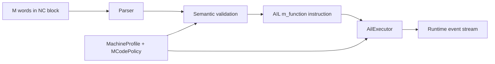
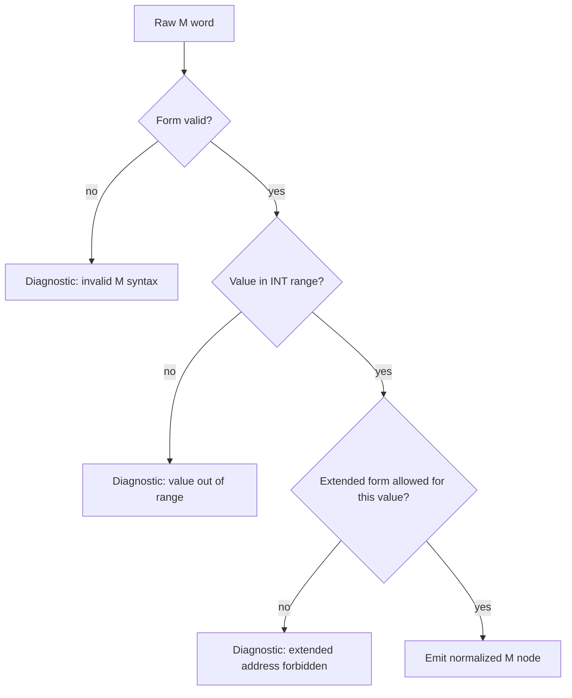
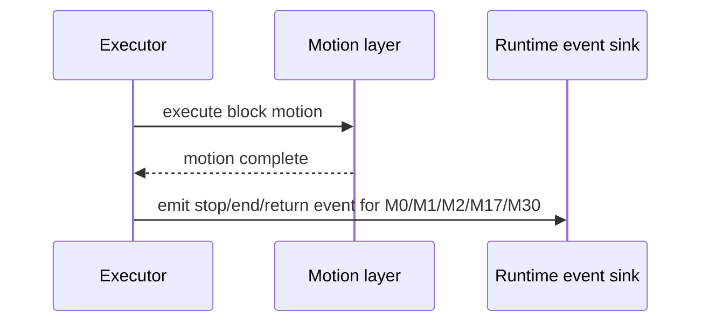

# Design: Siemens M-Code Model and Execution Boundaries

Task: `T-046` (architecture/design)

## Goal

Define an end-to-end Siemens-compatible M-code model for:
- syntax and validation (`M<value>`, `M<ext>=<value>`)
- AIL lowering/output shape
- runtime classification and execution boundaries
- machine/profile policy hooks

This design maps PRD Section 5.12.

## Scope

- syntax model and integer-range validation (`0..2147483647`)
- extended-address validity by M-function family
- executable vs parse-only classification model
- baseline predefined Siemens M set:
  - `M0/M1/M2/M3/M4/M5/M6/M17/M19/M30/M40..M45/M70`
- block-level M-count policy model (machine/config driven)
- timing model for stop/end functions (after traversing movement)
- subsystem interaction points (tool/spindle/coolant/control-flow)
- output schema expectations for AIL/runtime events

Out of scope:
- vendor PLC-specific custom M implementation
- machine I/O transport stack and actuator drivers

## Pipeline Boundaries



- Parser:
  - tokenizes and captures raw M forms and source locations
  - does not decide machine action behavior
- Semantic layer:
  - validates numeric range and form constraints
  - validates extended-address allowed/forbidden families
- AIL:
  - emits normalized `m_function` instructions
- Executor:
  - resolves instruction class (spindle/tool/flow/other)
  - applies policy for unknown/custom M functions
  - enforces timing constraints (post-motion trigger semantics)

## Syntax and Validation Model

Accepted forms:
- `M<value>`
- `M<ext>=<value>`

Validation rules:
- `<value>` type: signed integer text parsed as 32-bit non-negative range
  `0..2147483647`
- `<ext>` type: non-negative integer extension
- forbidden extended-address functions:
  - `M0`, `M1`, `M2`, `M17`, `M30`
- configurable limit for count of M words in one block:
  - baseline policy default: `max_m_per_block = 5`
  - machine profile may override



## Runtime Classification Model

Instruction classes:
- program-flow:
  - `M0`, `M1`, `M2`, `M17`, `M30`
- spindle:
  - `M3`, `M4`, `M5`, `M19`, `M70`
- tool:
  - `M6`
- gearbox:
  - `M40..M45`
- custom/other:
  - any other allowed integer value

Execution class meaning:
- parse-only:
  - represented in AIL/output, no actuator behavior in core runtime
- executable-control:
  - affects runtime state machine (stop/end/return/tool-change request)
- executable-machine:
  - emits typed machine events for downstream adapter/policy handling

Default v1 policy:
- known predefined set: executable-control or executable-machine event
- unknown set: governed by `unknown_mcode_policy` (`error|warning|ignore`)

## Timing Model (Post-Motion Trigger)

For `M0`, `M1`, `M2`, `M17`, `M30`:
- if block contains traversing motion and these M functions,
  runtime triggers stop/end semantics after traversing movement completion.



## Interaction Points

- Tool subsystem:
  - `M6` integrates with tool-selection/preselect model from tool-change design
    (`T-038`).
- Spindle subsystem:
  - `M3/M4/M5/M19/M70` map to spindle direction/stop/position/axis-mode events.
- Coolant/custom PLC:
  - non-predefined values are policy-dispatched; no core hardcoding.
- Control-flow subsystem:
  - `M17` return semantics integrate with subprogram call stack model (`T-050`).
  - `M2/M30` terminate current main-program execution context.

## Output Schema Expectations

AIL normalized shape (conceptual):

```json
{
  "kind": "m_function",
  "source": {"line": 120},
  "m_value": 3,
  "address_extension": null,
  "class": "spindle",
  "timing": "in_block_or_post_motion",
  "raw": "M3"
}
```

Runtime event shape (conceptual):

```json
{
  "event": "m_function",
  "m_value": 30,
  "class": "program_flow",
  "phase": "post_motion",
  "action": "program_end"
}
```

## Machine Profile / Policy Contracts

Proposed profile fields:
- `max_m_per_block` (integer)
- `unknown_mcode_policy` (`error|warning|ignore`)
- `enable_extended_m_address` (bool)
- `mcode_class_overrides` (map<int, class>)

Policy interface sketch:

```cpp
struct MCodeExecutionPolicy {
  virtual MCodeResolution resolve(int value,
                                  std::optional<int> extension,
                                  const MachineProfile& profile) const = 0;
};
```

## Implementation Slices (follow-up tasks)

1. Parser/semantic hardening
- enforce full extended-address family restrictions
- add per-block M-count validation with profile default

2. AIL schema extension
- add normalized class/timing metadata on `m_function` instructions

3. Executor classification path
- classify known predefined M values into control/machine events
- keep unknown policy behavior configurable

4. Timing semantics
- enforce post-motion trigger for `M0/M1/M2/M17/M30`

5. Integration points
- connect `M6` with tool-change policy path
- connect `M17/M2/M30` with subprogram/main-program control flow

## Test Matrix (implementation PRs)

- parser tests:
  - valid/invalid forms, range, extension restrictions, per-block count
- AIL tests:
  - normalized instruction metadata for class/timing/raw/source
- executor tests:
  - known vs unknown policy outcomes
  - post-motion timing for stop/end/return set
- docs/spec sync:
  - program reference + SPEC sections updated per feature slice

## Traceability

- PRD: Section 5.12 (M functions)
- Backlog: `T-046`
- Coupled tasks: `T-038` (tool change), `T-050` (subprogram return flow)
