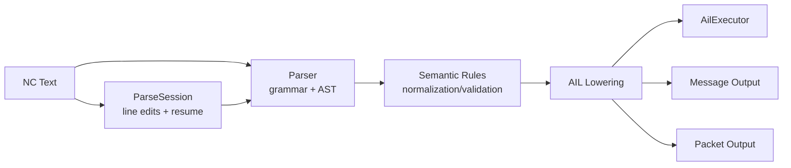

# Parser/Runtime Pipeline

## High-Level Flow

## Current Module Layout

- Parser layer:
  - `grammar/GCode.g4`
  - `src/gcode_parser.*`
  - `src/ast.h`
- Semantic layer:
  - `src/semantic_rules.*`
- AIL/runtime layer:
  - `src/ail.*`
- Message/packet output:
  - `src/messages*`
  - `src/packet*`

## Responsibility Boundaries

- Parser:
  - recognize syntax and locations
  - preserve source structure
- Semantic rules:
  - enforce shape/compatibility rules
  - generate actionable diagnostics
- Lowering/runtime:
  - build executable IR (AIL)
  - execute control-flow semantics

## Notes

This is a summary of root `ARCHITECTURE.md` sections 3, 4, and 7.
