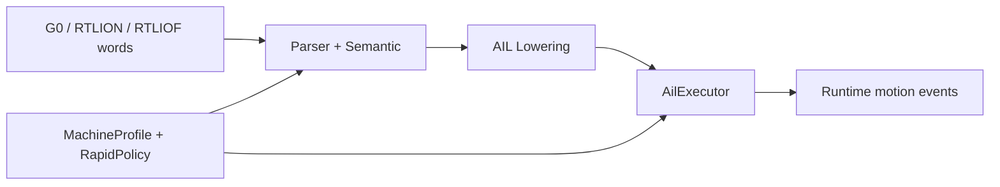
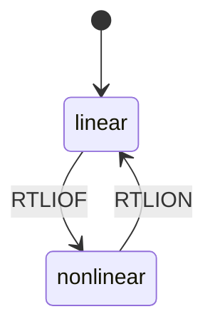
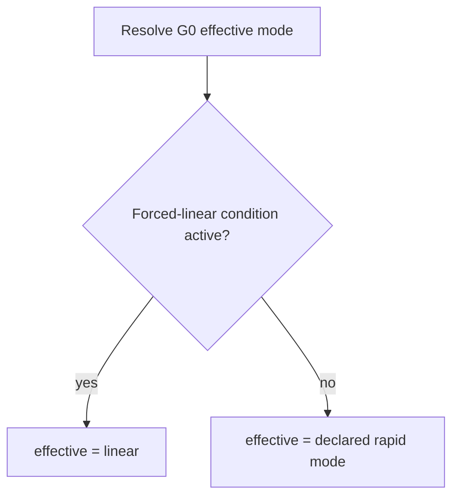

# Design: Rapid Traverse Model (`G0`, `RTLION`, `RTLIOF`)

Task: `T-045` (architecture/design)

## Goal

Define Siemens-compatible rapid-traverse semantics for:
- `G0` positioning moves
- rapid interpolation mode control (`RTLION` / `RTLIOF`)
- effective-behavior overrides where nonlinear rapid is forced back to linear

This design maps PRD Section 5.11.

## Scope

- `G0` representation and parse/lowering/runtime behavior
- modal rapid interpolation state model (`RTLION`/`RTLIOF`)
- effective-behavior override precedence rules
- interaction points with Group 10 transitions and compensation/transform states
- output schema expectations for configured vs effective rapid behavior

Out of scope:
- low-level trajectory generation/servo tuning
- machine-specific acceleration, jerk, and path planner internals

## Pipeline Boundaries



- Parser/semantic:
  - captures declared rapid mode words and `G0` moves
  - validates syntax and same-block mode declarations
- AIL:
  - emits `rapid_mode` state instructions and `motion_linear` for `G0`
  - carries both declared and effective rapid mode metadata for `G0`
- Executor:
  - maintains current rapid mode state
  - computes effective rapid behavior using override conditions

## State Model

Rapid interpolation mode state:
- `linear` (`RTLION`)
- `nonlinear` (`RTLIOF`)

Baseline defaults:
- startup/default rapid mode: profile-defined (`linear` default for safety)

State transition:
- `RTLION` and `RTLIOF` are modal control words affecting subsequent `G0`
  moves until changed.



## Declared vs Effective Rapid Mode

`G0` output should differentiate:
- declared rapid mode: current modal state (`linear`/`nonlinear`)
- effective rapid mode: actual runtime mode after override rules

Reason:
- Siemens behavior may force linear interpolation despite `RTLIOF`.
- downstream consumers need both intent and effective execution behavior.

## Override/Precedence Rules

If any forced-linear condition is active at `G0` execution point,
effective rapid mode becomes `linear` even when declared mode is `nonlinear`.

Forced-linear conditions (initial set):
- active Group 10 continuous-path mode requiring linear rapid coupling
  (profile-defined mapping, e.g. `G64` path mode behavior)
- active tool-radius compensation state requiring path interpolation
- active transformation/compressor mode flagged by runtime context

Precedence order:
1. safety/compatibility forced-linear conditions
2. declared rapid mode (`RTLION`/`RTLIOF`)
3. profile default



## Interaction Points

- Group 10 (`G60/G64..G645`):
  - transition mode may constrain rapid interpolation behavior
- Group 7 (`G40/G41/G42`):
  - active compensation may disable nonlinear rapid behavior
- transformation/compressor runtime state:
  - runtime context can force linear mode by policy

This design keeps these as policy/context hooks, not hardcoded parser rules.

## Output Schema Expectations

AIL `rapid_mode` instruction (conceptual):

```json
{
  "kind": "rapid_mode",
  "mode": "nonlinear",
  "source": {"line": 42}
}
```

AIL/packet `G0` motion metadata (conceptual):

```json
{
  "kind": "motion_linear",
  "opcode": "G0",
  "rapid_mode_declared": "nonlinear",
  "rapid_mode_effective": "linear",
  "source": {"line": 43}
}
```

Runtime event (conceptual):

```json
{
  "event": "rapid_move",
  "declared_mode": "nonlinear",
  "effective_mode": "linear",
  "reason": "forced_linear_due_to_comp_or_transform"
}
```

## Machine Profile / Policy Hooks

Suggested config fields:
- `rapid_default_mode` (`linear|nonlinear`)
- `force_linear_with_continuous_path` (bool or group-map)
- `force_linear_with_tool_radius_comp` (bool)
- `force_linear_with_transform` (bool)

Policy interface sketch:

```cpp
struct RapidTraversePolicy {
  virtual RapidMode resolveEffectiveMode(RapidMode declared,
                                         const RuntimeContext& ctx,
                                         const MachineProfile& profile) const = 0;
};
```

## Implementation Slices (follow-up)

1. Schema and metadata alignment
- ensure `G0` carries declared+effective rapid mode in AIL/packet outputs

2. Executor effective-mode resolution
- centralize forced-linear logic in policy/context layer

3. Group/state integration
- wire Group 10 and Group 7 state into effective-mode resolver inputs

4. Diagnostics and explainability
- optional runtime diagnostic/event when declared mode is overridden

## Test Matrix (implementation PRs)

- parser tests:
  - `RTLION`/`RTLIOF` syntax acceptance and ordering
- AIL tests:
  - modal rapid-mode instruction emission
  - declared/effective metadata on `G0`
- executor tests:
  - mode state transitions
  - forced-linear override scenarios
- packet tests:
  - stable schema for rapid metadata

## Traceability

- PRD: Section 5.11 (rapid traverse movement)
- Backlog: `T-045`
- Coupled tasks: `T-044` (Group 10), `T-039` (Group 7)
