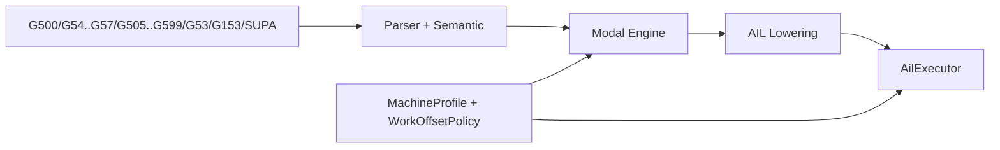
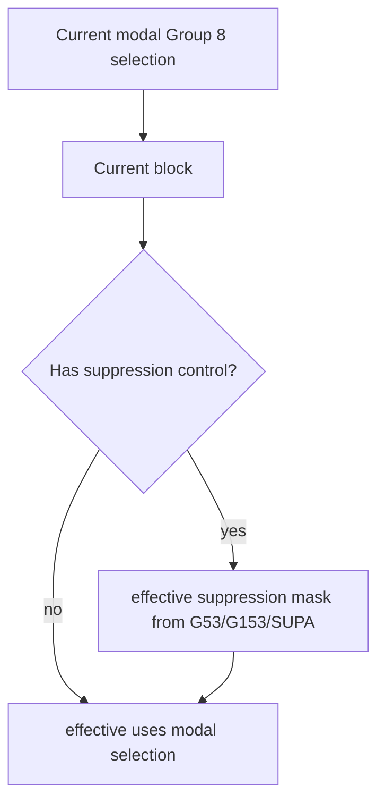

# Design: Work-Offset Model (Group 8 + `G53`/`G153`/`SUPA`)

Task: `T-043` (architecture/design)

## Goal

Define Siemens-compatible architecture for:
- modal Group 8 settable work offsets (`G500`, `G54..G57`, `G505..G599`)
- non-modal suppression controls (`G53`, `G153`, `SUPA`)
- machine-configuration variability for offset availability/ranges

This design maps PRD Section 5.9.

## Scope

- Group 8 modal state ownership/propagation
- block-scope suppression context semantics and precedence
- configuration model for machine-dependent offset ranges/aliases
- interaction points with coordinate/frame/dimension state pipeline
- output schema expectations for selected offset and effective suppression

Out of scope:
- full controller frame-chain internals and kinematic transforms
- HMI tooling for zero-offset table editing

## Pipeline Boundaries



- Parser/semantic:
  - captures modal Group 8 words and suppression commands per block
  - validates supported offset codes against profile range set
- Modal engine:
  - maintains persistent Group 8 selected offset code
  - resolves block-local suppression mask from `G53`/`G153`/`SUPA`
- AIL/executor:
  - carries both selected offset state and effective suppression context
  - exposes runtime-consumable metadata, without embedding full frame math

## State Model

Persistent Group 8 modal state:
- `g500` (deactivate settable work offset; base-frame behavior by profile)
- `g54`, `g55`, `g56`, `g57`
- `g505`..`g599` (machine-dependent subset)

Block-scope suppression controls (non-modal):
- `G53`: suppress settable and programmable work offsets
- `G153`: `G53` suppression plus basic-frame suppression
- `SUPA`: `G153` suppression plus DRF/overlay/external-zero/PRESET suppression



## Precedence and Scope Rules

1. Group 8 selection is modal and persists across blocks until changed.
2. `G53`/`G153`/`SUPA` are non-modal; they affect only the current block.
3. Suppression controls do not mutate stored Group 8 modal selection.
4. If multiple suppression controls occur in one block, effective mask uses
   strongest suppression level (`SUPA` > `G153` > `G53`) and emits a warning.

Applicability examples:
- `G54` then motion in next block => `G54` remains selected.
- `G54` with same-block `G53` => selected state remains `G54`, effective
  suppression applies for that block only.
- next block without suppression => effective context returns to selected `G54`.

## Configuration / Machine-Profile Model

Required profile fields:
- `default_group8_offset` (startup selection, e.g. `g500` or `g54`)
- `supported_group8_offsets` (range set; supports 828D-style variants)
- `legacy_aliases` (optional mapping such as `G58/G59` handling policy)
- `duplicate_suppression_policy` (`warn|error|first_wins`)

Validation behavior:
- unsupported Group 8 code emits diagnostic and does not update modal state
- suppression controls always parse; profile may tighten same-block policy

## Coordinate Pipeline Integration

Work-offset state composes with other coordinate states:
- dimensions/units (`T-042`) influence numeric interpretation, not Group 8 ID
- transition/rapid states (`T-044`/`T-045`) consume effective coordinate context
- runtime motion/planner uses effective suppression mask plus selected offset
  identifier to resolve actual frame chain outside parser core

## Output Schema Expectations

AIL state instruction concept:

```json
{
  "kind": "work_offset",
  "group8_selected": "g54",
  "suppression": "g53",
  "suppression_scope": "block",
  "source": {"line": 120}
}
```

Runtime effective context concept:

```json
{
  "effective_work_offset_selected": "g54",
  "effective_work_offset_enabled": false,
  "effective_suppression_mask": "suppress_settable_and_programmable"
}
```

Notes:
- outputs should include both selected modal code and effective block behavior
- runtime/planner can decide frame-chain math using machine-specific policies

## Policy Interface Sketch

```cpp
struct WorkOffsetPolicy {
  virtual EffectiveWorkOffset resolve(const ModalState& modal,
                                      const BlockContext& block,
                                      const RuntimeContext& ctx,
                                      const MachineProfile& profile) const = 0;
};
```

## Implementation Slices (follow-up)

1. Group 8 modal registry alignment
- ensure full Group 8 code set and profile-backed validation paths

2. Suppression context representation
- add explicit block-level suppression metadata for `G53`/`G153`/`SUPA`

3. AIL/runtime propagation
- expose selected offset + effective suppression metadata per block

4. Diagnostics/policy wiring
- validate unsupported offsets and duplicate suppression controls per policy

## Test Matrix (implementation PRs)

- parser tests:
  - Group 8 syntax acceptance/rejection with profile range variants
  - suppression command parse coverage
- modal-engine tests:
  - Group 8 persistence across blocks
  - block-local suppression precedence and non-mutation of modal selection
- AIL/executor tests:
  - selected/effective work-offset metadata stability
  - policy behavior for duplicate suppression words
- docs/spec sync:
  - add work-offset syntax/runtime sections as slices are implemented

## Traceability

- PRD: Section 5.9 (settable work offsets + suppression controls)
- Backlog: `T-043`
- Coupled tasks: `T-042` (dimensions), `T-044` (transition modes)
