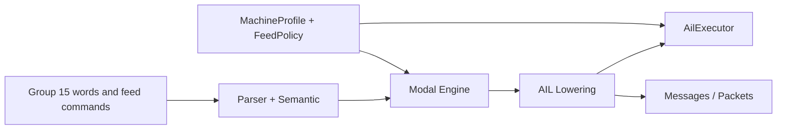
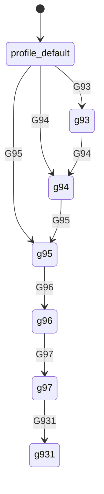
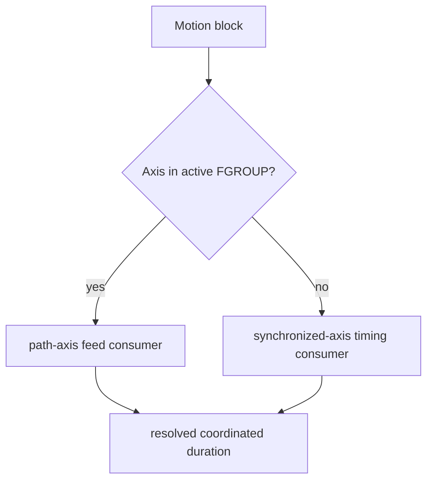
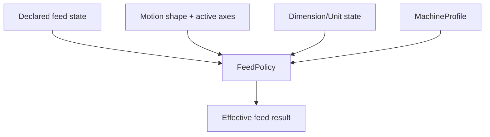

# Design: Siemens Feedrate Model (Modal Group 15)

Task: `T-041` (architecture/design)

## Goal

Define Siemens-compatible architecture for:
- Group 15 feed-mode state (`G93`, `G94`, `G95`, `G96`, `G97`, `G931`,
  `G961`, `G971`, `G942`, `G952`, `G962`, `G972`, `G973`)
- feed value programming via `F`
- path-group selection via `FGROUP(...)`
- rotary effective-radius input via `FGREF[axis] = value`
- axis speed limits via `FL[axis] = value`

This design maps PRD Section 5.7.

## Scope

- feed-state ownership and propagation through parse -> modal -> AIL -> runtime
- Group 15 transition model and `F` reprogramming rules
- path-axis versus synchronized-axis partitioning via `FGROUP`
- mixed linear/rotary feed interpretation via `FGREF`
- coordinated timing limits via `FL`
- machine-profile and policy hooks for controller-specific runtime behavior

Out of scope:
- low-level interpolator, servo, and spindle control implementation
- full Siemens machine-data database replication
- cycle-specific feed overrides outside the baseline Group 15 model

## Current Baseline and Migration Need

Current implementation is intentionally smaller than the PRD requirement:
- motion messages, AIL instructions, and packets carry a single optional scalar
  `feed`
- no explicit Group 15 modal state is represented yet
- no model exists yet for `FGROUP`, `FGREF`, or `FL`
- unit coupling to `G700/G710` is not yet explicit

Migration target:
- keep the existing scalar `feed` field as the user-programmed value carrier
  for simple consumers
- add explicit feed-state instructions and effective feed metadata so runtime
  and downstream consumers can distinguish declared mode from resolved behavior

## Pipeline Boundaries



- Parser/semantic:
  - parses feed mode words, `F`, `FGROUP`, `FGREF`, and `FL`
  - validates statement shape and same-block conflicts
- Modal engine:
  - owns persistent Group 15 state
  - owns active path-group membership and axis feed-limit state
- AIL lowering:
  - emits explicit feed-state instructions and motion instructions carrying
    feed metadata references
- Executor/runtime:
  - resolves effective feed semantics for path axes and synchronized axes
  - applies profile and policy rules to compute explainable runtime behavior

## State Model

Group 15 should be represented as explicit modal state with distinct members:
- `g93`: inverse-time feed
- `g94`: path feed per minute
- `g95`: feed per spindle revolution
- `g96`: constant-cutting-rate coupled mode
- `g97`: constant-rpm coupled mode
- `g931`, `g961`, `g971`, `g942`, `g952`, `g962`, `g972`, `g973`:
  Siemens-specific distinct Group 15 modal members

Associated persistent feed context:
- programmed `F` value
- `fgroup_axes`: active path-axis set
- `fgref_by_axis`: rotary effective-radius map
- `fl_by_axis`: axis speed-limit map
- `feed_requires_reprogramming`: latch set when Group 15 transition requires
  a fresh `F`

Defaulting rules:
- startup Group 15 mode is profile-defined
- startup `FGROUP` comes from machine profile default path grouping
- startup `FGREF`/`FL` maps are empty unless profile seeds them

## Transition and Persistence Rules

1. Group 15 members are mutually exclusive and persist until another Group 15
   word is programmed.
2. Changing between Group 15 members does not erase stored `F`, but it does set
   `feed_requires_reprogramming` when the contract requires an explicit new `F`.
3. `F` updates the programmed feed value for the current feed mode.
4. `FGROUP(...)` replaces the active path-axis set.
5. `FGROUP()` with empty arguments restores the machine-profile default group.
6. `FGREF[axis] = value` updates only the named rotary-axis reference entry.
7. `FL[axis] = value` updates only the named axis speed-limit entry.



The full Group 15 enum is explicit in code; the diagram only illustrates the
state-machine pattern.

## Path-Axis and Synchronized-Axis Model

`FGROUP` partitions axes into:
- path axes: axes whose geometric contribution defines commanded path feed
- synchronized axes: axes that must finish at the same block end time but do
  not directly define path feed



Implications:
- `F` is interpreted primarily against the active path group
- synchronized axes inherit block duration from the resolved path duration
- `FL` can force a longer duration if an axis cannot satisfy the requested
  coordinated timing

## Mixed Linear/Rotary Interpretation

`FGREF` is needed when a rotary axis participates in path-feed interpretation.

Resolution concept:
1. determine active path axes from `FGROUP`
2. identify rotary axes participating in feed calculation
3. apply `FGREF` effective radius for those rotary axes
4. combine linear and converted rotary contributions under the current Group 15
   mode

Policy boundary:
- missing `FGREF` for a required rotary axis should be profile/policy driven:
  error, warning with fallback, or machine-default fallback

## Unit Coupling

This design must compose with `T-042` dimensions/units architecture.

Rules:
- Group 13 `G70/G71` affects geometric lengths only
- Group 13 `G700/G710` affects geometry and technological length data
- therefore Group 15 feed interpretation must consume the effective unit scope,
  not just raw numeric `F`

Practical effect:
- feed-state resolution depends on both Group 15 mode and Group 13 unit scope
- output metadata should preserve enough information to explain how numeric `F`
  was interpreted

## Runtime Resolution Contract

Runtime should separate declared feed state from effective feed execution.

Declared state includes:
- current Group 15 member
- programmed `F`
- active `FGROUP`
- stored `FGREF` and `FL` entries

Effective state includes:
- resolved feed interpretation kind
- resolved coordinated block duration or path feed
- limit/override reasons such as axis-limit throttling



## Output Schema Expectations

AIL feed-state instruction concept:

```json
{
  "kind": "feed_state",
  "group15_mode": "g95",
  "feed_value": 0.2,
  "requires_reprogramming": false,
  "source": {"line": 24}
}
```

AIL path-group instruction concept:

```json
{
  "kind": "feed_group",
  "path_axes": ["X", "Y", "C"],
  "source": {"line": 25}
}
```

AIL axis feed constraint concept:

```json
{
  "kind": "axis_feed_limit",
  "axis": "C",
  "limit": 120.0,
  "source": {"line": 26}
}
```

Motion metadata concept:

```json
{
  "kind": "motion_linear",
  "opcode": "G1",
  "feed_mode": "g94",
  "feed_value": 150.0,
  "path_axes": ["X", "Y"],
  "effective_unit_scope": "geometry_and_technology"
}
```

## Machine Profile / Policy Hooks

Suggested profile/config fields:
- `default_group15_mode`
- `default_fgroup_axes`
- `require_explicit_f_after_group15_change`
- `missing_fgref_policy`
- `allow_rotary_path_feed_without_fgref`
- `default_fl_limits`

Policy interface sketch:

```cpp
struct FeedResolutionResult {
  std::string effective_mode;
  std::optional<double> effective_feed_value;
  std::optional<double> coordinated_duration_ms;
  std::vector<std::string> reasons;
};

struct FeedPolicy {
  virtual FeedResolutionResult resolve(const FeedState& state,
                                       const MotionContext& motion,
                                       const DimensionContext& dims,
                                       const MachineProfile& profile) const = 0;
};
```

## Integration Points

- `T-042` dimensions/units:
  - Group 13 unit scope changes feed-length interpretation
- `T-040` working plane:
  - arc/helical path-length resolution consumes both plane and feed state
- `T-039` Group 7 compensation:
  - compensated path geometry changes runtime path-length calculation inputs
- `T-044` Groups 10/11/12:
  - transition/exact-stop policies can interact with effective coordinated
    timing
- future tool/runtime policies:
  - spindle-coupled feed modes and constant-cutting-rate logic need runtime
    interfaces rather than parser-only behavior

## Implementation Slices (follow-up)

1. Feed-state schema scaffold
- introduce explicit Group 15 enum/state structures and AIL feed-state
  instruction skeletons

2. `F` and reprogramming contract
- define transition behavior and diagnostics for mode changes that require a
  fresh `F`

3. `FGROUP` representation
- model path-axis membership and synchronized-axis partition metadata

4. `FGREF` and mixed rotary feed
- add rotary reference-radius representation and policy-driven diagnostics

5. `FL` coordinated limit behavior
- integrate axis speed-limit metadata into runtime feed resolution

6. Packet/message exposure
- add stable machine-readable feed metadata once runtime semantics are wired

## Test Matrix (implementation PRs)

- parser tests:
  - acceptance/rejection for Group 15 words, `FGROUP`, `FGREF`, and `FL`
- modal-engine tests:
  - Group 15 transitions and persistence
  - `F` reprogramming latch behavior
  - `FGROUP()` default reset behavior
- AIL tests:
  - explicit feed-state / feed-group / axis-limit instruction shapes
- executor tests:
  - path-axis versus synchronized-axis timing behavior
  - `FL`-driven duration throttling
  - missing-`FGREF` policy outcomes
- packet/message tests:
  - stable schema for effective feed metadata
- docs/spec sync:
  - update SPEC sections for Group 15 and feed runtime behavior per slice

## Traceability

- PRD: Section 5.7 (Siemens feedrate semantics)
- Backlog: `T-041`
- Coupled tasks: `T-042` (dimensions), `T-040` (plane), `T-039` (comp),
  `T-044` (transition modes)
