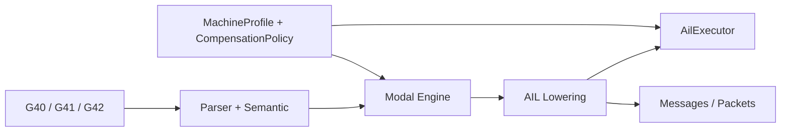
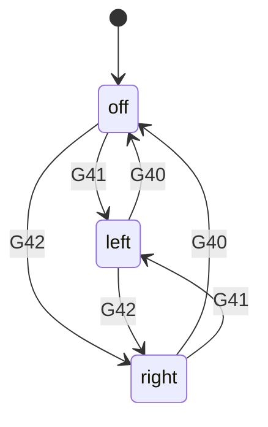
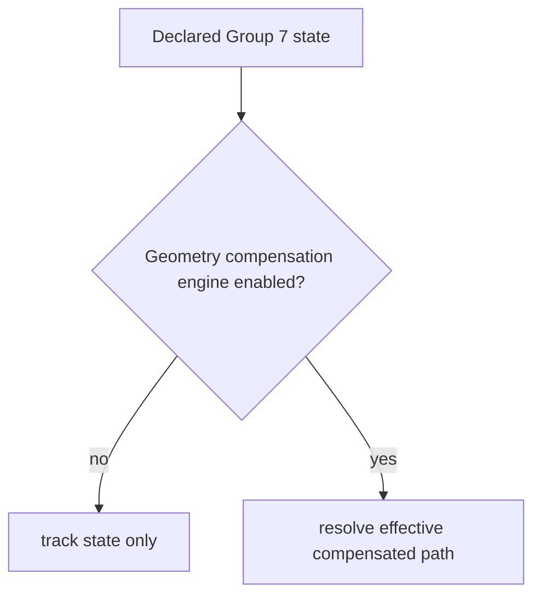

# Design: Siemens Modal Group 7 (`G40`, `G41`, `G42`)

Task: `T-039` (architecture/design)

## Goal

Define Siemens-compatible architecture for Group 7 tool-radius-compensation
state so that:
- `G40`, `G41`, and `G42` are represented as explicit modal state
- modal transitions are deterministic and independent from motion state
- parse, AIL, executor, message, and packet layers carry the right state
  boundaries
- future geometric cutter-compensation behavior can be layered on without
  breaking the existing baseline

This design maps PRD Section 5.5.

## Scope

- Group 7 state ownership across parse -> modal -> AIL -> runtime
- parse/lowering/runtime behavior for `G40`, `G41`, `G42`
- interaction points with motion, working plane, and rapid/transition states
- output schema expectations for declared compensation state
- migration path from current baseline to fuller Siemens behavior

Out of scope:
- full compensated toolpath geometry generation
- controller-specific contour entry/exit heuristics
- machine-specific wear/radius table integration beyond policy boundaries

## Current Baseline

Current implementation already provides a v0 Group 7 baseline:
- parser recognizes `G40`, `G41`, and `G42`
- AIL lowers them to explicit `tool_radius_comp` instructions
- executor tracks `tool_radius_comp_current`
- packet stage does not emit standalone packets for Group 7 instructions
- no geometric path offsetting is performed yet

This architecture note formalizes that baseline and defines the extension path.

## Pipeline Boundaries



- Parser/semantic:
  - recognizes Group 7 commands and validates same-block conflicts
  - preserves source form and normalized Group 7 interpretation
- Modal engine:
  - owns persistent Group 7 state independently from motion group state
- AIL lowering:
  - emits explicit state-transition instructions for Group 7
  - attaches active compensation metadata to motion consumers when needed
- Executor/runtime:
  - tracks current declared compensation mode
  - later resolves effective behavior with plane/profile/policy context

## State Model

Group 7 members:
- `off` (`G40`)
- `left` (`G41`)
- `right` (`G42`)

Representation requirement:
- Group 7 must be a first-class modal group, not overloaded into motion state
  or ad hoc booleans.

Minimal runtime state:
- current Group 7 mode
- source of last transition
- optional future effective-compensation details resolved by policy



## Transition Rules

1. Group 7 is modal and persists until another Group 7 command is programmed.
2. Group 7 transitions are independent from Group 1 motion selection.
3. same-block conflicting Group 7 words are handled by the central modal
   conflict policy.
4. repeating the same Group 7 code in one block is allowed under the existing
   modal-registry baseline unless policy says otherwise.
5. `G40` changes declared state to compensation off but does not itself imply a
   motion or packet event.

## Declared State vs Effective Behavior

The architecture must distinguish:
- declared compensation mode: `off|left|right`
- effective geometric behavior: what runtime actually does with the path

Reason:
- v0 already supports declared-state tracking
- future Siemens behavior needs plane-aware and motion-aware geometry changes
- downstream tooling must be able to inspect declared modal state even when
  no geometric compensation engine is active



## Interaction Points

- Working plane (`T-040`):
  - Group 7 semantics are plane-dependent
  - `G17/G18/G19` decide which contour plane compensation is interpreted in
- Motion family:
  - compensation meaning applies to contouring motion, not as a standalone
    packetized event
- Rapid traverse (`T-045`):
  - rapid policy may force linear/effective behavior constraints while Group 7
    is active
- Exact-stop / continuous-path (`T-044`):
  - transition behavior can affect how compensated path segments are executed
- Feed model (`T-041`):
  - effective path length under compensation feeds into future feed resolution

## Output Schema Expectations

AIL Group 7 instruction concept:

```json
{
  "kind": "tool_radius_comp",
  "opcode": "G41",
  "mode": "left",
  "source": {"line": 42}
}
```

Executor/runtime state concept:

```json
{
  "tool_radius_comp_current": "left",
  "source": {"line": 42}
}
```

Future motion metadata concept:

```json
{
  "kind": "motion_linear",
  "opcode": "G1",
  "tool_radius_comp_declared": "left",
  "tool_radius_comp_effective": "left",
  "working_plane": "g17"
}
```

Packet-stage rule:
- Group 7 instructions do not emit standalone motion packets
- their effect is represented through modal state and later motion metadata

## Machine Profile / Policy Hooks

Suggested profile/config fields:
- `default_tool_radius_comp_mode`
- `allow_group7_without_geometry_engine`
- `group7_conflict_policy`
- `require_plane_for_compensation_resolution`
- `compensation_geometry_policy`

Policy interface sketch:

```cpp
struct CompensationResolution {
  std::string declared_mode;
  std::string effective_mode;
  std::vector<std::string> reasons;
};

struct CompensationPolicy {
  virtual CompensationResolution resolve(const ModalState& modal,
                                         const MotionContext& motion,
                                         const MachineProfile& profile) const = 0;
};
```

## Migration Plan

Current baseline:
- explicit `tool_radius_comp` AIL instruction
- executor state tracking only
- packet-stage ignore for standalone Group 7 commands

Follow-up migration:
1. modal-engine ownership
- lift Group 7 into centralized modal-state transitions explicitly

2. motion metadata propagation
- attach declared Group 7 state to motion outputs/messages/packets

3. plane coupling
- resolve Group 7 semantics against active working plane

4. policy-driven effective behavior
- separate declared state from effective geometry/runtime behavior

5. optional geometry engine integration
- allow future compensated path generation without changing parse/AIL schema

## Implementation Slices (follow-up)

1. Modal-engine consolidation
- route Group 7 transitions through central modal engine APIs

2. Output metadata exposure
- carry declared Group 7 state on motion/message/packet outputs

3. Plane-aware runtime contract
- integrate Group 7 with working-plane state for effective behavior resolution

4. Policy boundary for geometry behavior
- introduce pluggable compensation policy without hardcoding controller details

## Test Matrix (implementation PRs)

- parser tests:
  - recognition of `G40/G41/G42`
  - same-block conflict handling for Group 7 words
- modal-engine tests:
  - persistence and deterministic transitions for Group 7
- AIL tests:
  - stable `tool_radius_comp` instruction schema
  - motion metadata includes declared Group 7 state when added
- executor tests:
  - runtime state tracking
  - future plane-aware/effective behavior resolution
- packet/message tests:
  - standalone Group 7 commands remain non-packet control-state updates
  - stable schema when motion metadata grows
- docs/spec sync:
  - update SPEC once declared vs effective behavior contracts expand

## SPEC Update Plan

When implementation moves beyond the current baseline, update:
- supported G-code/modal sections for explicit Group 7 semantics
- AIL/message/packet schema sections for declared/effective compensation state
- runtime behavior notes for plane-aware compensation resolution boundaries

## Traceability

- PRD: Section 5.5 (Group 7 tool radius compensation)
- Backlog: `T-039`
- Coupled tasks: `T-040` (working plane), `T-045` (rapid), `T-044` (transition),
  `T-041` (feed)
