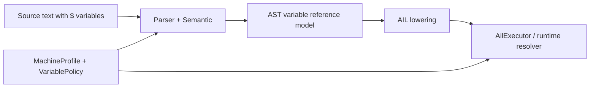

# Design: System Variables and Selector Model (`$...`, selectors, runtime evaluation)

Task: `T-048` (architecture/design)

## Goal

Define Siemens-compatible architecture for:
- simple system-variable tokens such as `$P_ACT_X`
- structured selector forms such as `$A_IN[1]` and `$P_UIFR[1,X,TR]`
- runtime resolver behavior for variable-backed conditions and expressions
- policy hooks for access restrictions and timing-class differences

This design maps PRD Section 5 variable/resolver requirements and the backlog
scope for `T-048`.

## Scope

- parser/AST representation for simple and selector-style system variables
- AIL/runtime boundaries for variable evaluation
- resolver result model for `value`, `pending`, and `error`
- policy hooks for read/write restrictions and timing classes
- staged implementation plan for syntax, lowering, and runtime integration

Out of scope:
- full Siemens parameter catalog implementation
- controller-specific hardware data sources for every variable family
- PLC/HMI authoring workflows

## Current Baseline

Already shipped in v0:
- simple `$...` token form parses in expressions and control-flow conditions
- selector-style forms are rejected as syntax
- AIL preserves simple `$...` references as `system_variable`
- runtime branch resolver contract already works for simple `$...` conditions
- runtime does not resolve `$...` control-flow targets such as `GOTO $DEST`

This note covers the next architecture step beyond that baseline.

## Pipeline Boundaries



- Parser/semantic:
  - parses simple token form and selector arguments
  - validates selector shape and family-specific admissible selector patterns
- AST:
  - preserves one normalized variable-reference node model
  - distinguishes user variables (`R...`) from system variables (`$...`)
- AIL:
  - preserves variable-reference structure for runtime evaluation
  - does not resolve live values during lowering
- Executor/runtime:
  - delegates variable reads/evaluation to resolver/policy interfaces
  - handles `value`, `pending`, and `error` outcomes deterministically

## Variable Reference Model

Recommended normalized AST/AIL concept:

```cpp
struct VariableSelectorPart {
  enum class Kind { Index, Axis, Attribute, Name };
  Kind kind;
  std::string text;
};

struct VariableReference {
  enum class Namespace { UserR, System };
  Namespace ns;
  std::string base_name;  // e.g. "R1", "$A_IN", "$P_UIFR"
  std::vector<VariableSelectorPart> selectors;
};
```

Examples:
- `R1`
  - `ns = UserR`
  - `base_name = "R1"`
  - `selectors = []`
- `$P_ACT_X`
  - `ns = System`
  - `base_name = "$P_ACT_X"`
  - `selectors = []`
- `$A_IN[1]`
  - `ns = System`
  - `base_name = "$A_IN"`
  - `selectors = [{Index, "1"}]`
- `$P_UIFR[1,X,TR]`
  - `ns = System`
  - `base_name = "$P_UIFR"`
  - `selectors = [{Index, "1"}, {Axis, "X"}, {Attribute, "TR"}]`

## Selector Grammar Strategy

Do not model selector content as raw string forever. Normalize it.

Recommended staged parser rule shape:
- simple variable:
  - `$<word>`
- selector variable:
  - `$<word>[<part>(,<part>)*]`

Selector-part categories in first implementation:
- numeric literal
- bare identifier token

Family-specific semantics should remain semantic-layer validation, not grammar
explosion. That keeps parsing stable while allowing:
- `$A_IN[1]`
- `$P_UIFR[1,X,TR]`
- future family-specific restriction tables

## Diagnostics Model

Current baseline:
- selector attempts fail as generic syntax diagnostics at the first unsupported
  bracket/comma token

Target architecture:
- parser/semantic emits structured diagnostics for:
  - missing closing `]`
  - empty selector list
  - empty selector item
  - too many selector parts for a family
  - invalid selector token class for a family

Examples of desired future messages:
- `system variable selector requires closing ']'`
- `system variable '$A_IN' requires exactly one numeric selector`
- `system variable '$P_UIFR' requires selector form [index,axis,attribute]`

## Runtime Resolver Contract

Variable resolution should be explicit and shared across:
- arithmetic expressions
- branch conditions
- future assignment/write validation

Recommended read result model:

```cpp
enum class VariableReadKind { Value, Pending, Error };

struct VariableReadResult {
  VariableReadKind kind = VariableReadKind::Error;
  double value = 0.0;
  std::optional<WaitToken> wait_token;
  std::optional<int64_t> retry_at_ms;
  std::optional<std::string> error_message;
};
```

Recommended resolver interface:

```cpp
struct VariableResolver {
  virtual VariableReadResult read(const VariableReference& ref,
                                  const SourceInfo& source) const = 0;
};
```

Semantics:
- `Value`
  - expression/condition evaluation continues
- `Pending`
  - branch executor can block on condition
  - future expression-evaluation surfaces need the same pending contract
- `Error`
  - runtime faults or policy-warns depending on evaluation surface

## Timing Classes and Policy Hooks

Not all variables have the same access characteristics.

Policy should be able to classify variables by timing/access:
- preprocessing-safe constants
- main-run live machine state
- write-protected runtime state
- channel-scoped vs global variables

Suggested policy sketch:

```cpp
enum class VariableTimingClass {
  PreprocessStable,
  RuntimeLive,
  RuntimeBlocking
};

struct VariablePolicy {
  virtual VariableTimingClass timingClass(
      const VariableReference& ref) const = 0;
  virtual bool canWrite(const VariableReference& ref) const = 0;
};
```

This keeps parser core independent from controller-specific catalogs while
making policy decisions explicit.

## Control-Flow Interaction

Separate two cases:

1. Variable-backed conditions
- supported path already exists for simple `$...` tokens
- structured selectors should extend the same `ConditionResolver` contract

2. Variable-backed branch targets
- currently unresolved at runtime in v0
- future support should not be added accidentally
- if added later, it needs a dedicated target-resolution contract, not implicit
  reuse of label/line-number lookup

That distinction prevents variable read semantics from being conflated with
control-flow target resolution.

## Output Schema Expectations

AST / AIL JSON should stop flattening selector forms into opaque strings once
selector support lands.

Future stable JSON concept:

```json
{
  "kind": "system_variable",
  "base_name": "$P_UIFR",
  "selectors": [
    {"kind": "index", "text": "1"},
    {"kind": "axis", "text": "X"},
    {"kind": "attribute", "text": "TR"}
  ]
}
```

Backward-compatibility strategy:
- keep existing `kind: "system_variable"` for simple token form
- add `base_name` and `selectors`
- preserve legacy `name` field for a deprecation window if CLI goldens need
  schema stability during migration

## Implementation Slices

1. AST normalization
- add structured variable-reference node for system selectors

2. Parser diagnostics
- replace generic bracket/comma syntax failures with selector-aware messages

3. AIL JSON migration
- preserve structured selector metadata in expression/condition nodes

4. Runtime resolver abstraction
- introduce shared variable-read interface for expressions/conditions

5. Policy integration
- add timing/access classification hooks and write restrictions

6. Future target indirection decision
- explicitly decide whether `$...` branch targets will ever be runtime-resolved

## Test Matrix

- parser tests:
  - accepted/rejected selector shapes
  - diagnostic locations and selector-specific messages
- AIL tests:
  - structured selector JSON shape
  - parity between simple and selector-backed variable references
- executor tests:
  - variable-backed condition `pending/error/value`
  - policy-driven rejection for unsupported timing/access classes
- docs/spec sync:
  - syntax, JSON shape, runtime resolver sections updated together

## Traceability

- Backlog: `T-048`
- Coupled tasks:
  - future parser selector slices for `$...[...]`
  - future runtime resolver abstraction slices
  - policy/model slices for access restrictions and timing classes
