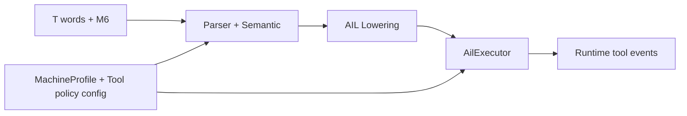
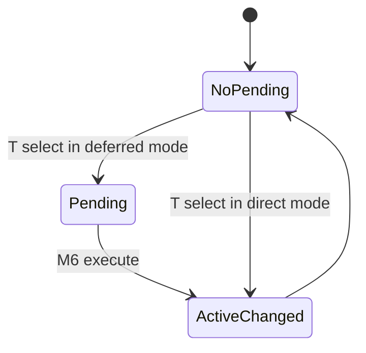

# Design: Siemens Tool-Change Semantics (`T...` + `M6`, with/without Tool Management)

Task: `T-038` (architecture/design)

## Goal

Define configurable Siemens-compatible tool-change behavior for:
- direct-change mode (`T` triggers immediate tool change)
- preselect + deferred-change mode (`T` selects, `M6` executes)
- tool-management off/on variants (number vs location/name selectors)
- substitution/resolution policy integration

This design maps PRD Section 5.4.

## Scope

- AST/AIL/runtime representation boundaries for tool-select and tool-change
- machine-configuration model for direct vs deferred mode
- selection forms for management-off and management-on workflows
- resolver callbacks / policy configuration for tool resolution,
  substitution, and error behavior
- staged implementation plan and test matrix

Out of scope:
- full tool life management database implementation
- PLC or machine-specific toolchanger hardware integration

## Pipeline Boundaries



- Parser/semantic:
  - parses tool-select forms and `M6`
  - validates selector shape per configured tool-management mode
- AIL:
  - emits normalized `tool_select` and `tool_change` instructions
  - includes timing (`immediate` or `deferred_until_m6`) metadata
- Executor:
  - tracks pending selection state
  - resolves selection/substitution via executor config/callbacks and commits
    active tool state

## Instruction Contract

- Tool actions are machine-visible behavior, so they must be explicit executable
  instructions (`tool_select`, `tool_change`) in AIL.
- These instructions are not motion packets by default.
  - Motion packets remain a transport for geometry/motion families.
  - Tool instructions execute through runtime control-command handling.
- This keeps parser/lowering deterministic while allowing hardware-specific
  actuation mapping in runtime policy layers.

## Command Forms by Mode

### Without Tool Management

Supported selection forms:
- `T<number>`
- `T=<number>`
- `T<n>=<number>` (indexed selector)

Mode behaviors:
- direct-change mode: `T...` selects and immediately activates tool/offset
- preselect+M6 mode: `T...` stores pending selection; `M6` executes swap/activate

### With Tool Management

Supported selection forms:
- `T=<location>`
- `T=<name>`
- `T<n>=<location>`
- `T<n>=<name>`

Mode behaviors:
- direct-change mode: `T=...` resolves location/name and activates immediately
- preselect+M6 mode: `T=...` stores pending resolved candidate; `M6` commits

## State Model

Runtime tool-related state:
- `active_tool` (currently effective tool)
- `pending_tool_selection` (optional, for deferred mode)
- `tool_change_mode` (`direct` or `deferred_m6`)
- `tool_management_enabled` (bool)



## Precedence and Semantics

1. Machine profile decides direct-vs-deferred mode.
2. Selector grammar validity depends on `tool_management_enabled`.
3. In deferred mode:
  - `T...` updates `pending_tool_selection`
  - `M6` consumes pending selection and activates it
4. In direct mode:
  - `T...` immediately activates resolved tool and clears pending state
  - standalone `M6` is policy-controlled (warn/error/ignore)
5. If multiple `T...` appear before `M6`, last valid selection wins.

## Policy and Resolution Contracts

Tool resolution responsibilities:
- normalize selector (`number/location/name`)
- resolve substitution candidates where allowed
- produce `resolved | unresolved | ambiguous` outcome

Policy controls:
- `on_unresolved_tool` (`error|warning|fallback`)
- `allow_substitution` (bool)
- `m6_without_pending_policy` (`error|warning|ignore`)

Policy interface sketch:

```cpp
struct ToolChangePolicy {
  virtual ToolSelectionResolution resolveSelection(
      const ToolSelector& selector,
      const MachineProfile& profile,
      const RuntimeContext& ctx) const = 0;
};
```

## Interaction Points

- M-code model (`T-046`):
  - `M6` classification remains in M-code domain, but execution routes through
    tool-change boundary contracts from this design.
- Work offsets (`T-043`):
  - tool activation may imply tool-offset state changes in runtime context.
- Subprogram/runtime flow (`T-050`):
  - pending-tool state should be channel/program-context scoped by policy.

## Output Schema Expectations

AIL `tool_select` concept:

```json
{
  "kind": "tool_select",
  "selector_kind": "number_or_name_or_location",
  "selector_value": "T=DRILL_10",
  "timing": "deferred_until_m6",
  "source": {"line": 200}
}
```

AIL `tool_change` concept:

```json
{
  "kind": "tool_change",
  "trigger": "m6",
  "source": {"line": 201}
}
```

Runtime event concept:

```json
{
  "event": "tool_change",
  "previous_tool": "T12",
  "new_tool": "T7",
  "selection_source": "pending_then_m6",
  "substituted": false
}
```

## Migration Plan (Small Slices)

1. Parse/AST normalization
- normalize all supported `T...` forms into one selector model

2. AIL instruction split
- emit explicit `tool_select` and `tool_change` instructions with timing metadata

3. Executor pending-state semantics
- implement direct vs deferred activation behavior

4. Policy integration
- add pluggable resolver/substitution path with deterministic diagnostics

5. Cross-feature integration
- align `M6` runtime path with M-code classification and offset side effects

## Backlog Tasks Generated (follow-up implementation)

- `T-051`: parser/AST tool-selector normalization (`T...` forms by mode)
- `T-052`: AIL schema for `tool_select`/`tool_change` + JSON/debug outputs
- `T-053`: executor pending-state + direct/deferred semantics
- `T-054`: tool policy resolver/substitution + unresolved/ambiguous diagnostics

Each follow-up task should include tests in `test/`, SPEC updates for behavior
changes, and `CHANGELOG_AGENT.md` entries.

## Test Matrix (implementation PRs)

- parser tests:
  - accepted/rejected selector forms by management mode
- AIL tests:
  - normalized instruction shape + timing metadata
- executor tests:
  - direct-change flow
  - preselect+M6 flow
  - `M6` without pending selection policies
  - last-selection-wins before `M6`
- integration tests:
  - interaction with M-code path and tool-offset side effects

## Traceability

- PRD: Section 5.4 (tool-change semantics)
- Backlog: `T-038`
- Coupled tasks: `T-046` (M-code), `T-043` (offset context), `T-050` (subprogram)
