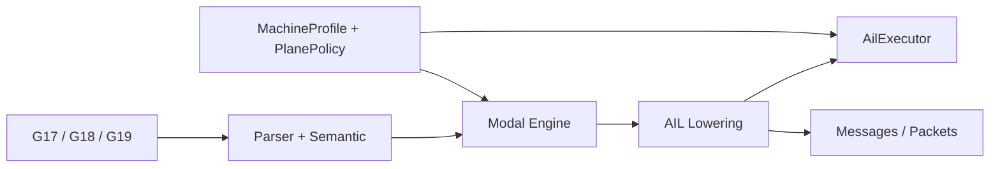
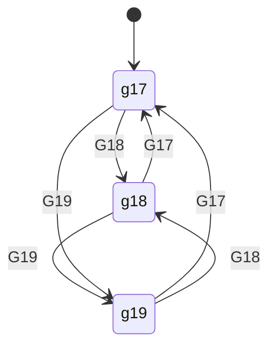
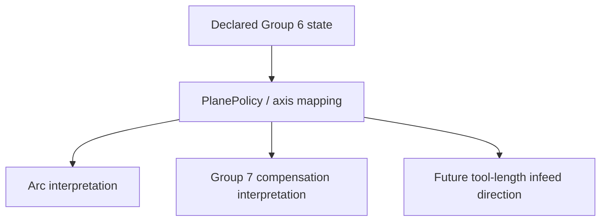

# Design: Working-Plane Modal Semantics (`G17`, `G18`, `G19`)

Task: `T-040` (architecture/design)

## Goal

Define Siemens-compatible architecture for modal working-plane semantics so
that:
- `G17`, `G18`, and `G19` are represented as explicit Group 6 modal state
- plane state propagates consistently through parse -> modal -> AIL -> runtime
- arc interpretation and compensation consumers can depend on one normalized
  plane model
- future tool-length and compensation features can compose on top of the same
  plane contract

This design maps PRD Section 5.6.

## Scope

- Group 6 state model for `G17/G18/G19`
- plane-state ownership and propagation across pipeline stages
- plane-aware interaction points for arcs, tool radius compensation, and future
  tool-length infeed direction
- migration from the current working-plane baseline to fuller Siemens semantics
- output schema expectations for declared and effective plane context

Out of scope:
- full machine-kinematics interpretation beyond standard geometry axes
- full geometric cutter-compensation algorithm
- low-level interpolator details beyond the plane contract

## Current Baseline

Current implementation already provides a meaningful Group 6 baseline:
- parser recognizes `G17`, `G18`, and `G19`
- AIL lowers them to explicit working-plane instructions
- executor tracks current working plane
- arc validation and lowering already use the active plane to decide allowed
  center words and emitted arc metadata
- packet stage preserves effective working plane on arc outputs

This design note formalizes that baseline and defines the remaining expansion
points.

## Pipeline Boundaries



- Parser/semantic:
  - recognizes Group 6 words and same-block conflicts
  - validates plane-dependent syntax consumers such as arc center words
- Modal engine:
  - owns persistent working-plane state independently from motion and Group 7
- AIL lowering:
  - emits explicit plane-state instructions
  - attaches effective plane metadata to plane-sensitive motion outputs
- Executor/runtime:
  - tracks current plane state
  - resolves declared plane into downstream behavior contracts for arcs,
    compensation, and future infeed-direction consumers

## State Model

Group 6 members:
- `g17`: XY plane, infeed/tool-length direction `Z`
- `g18`: ZX plane, infeed/tool-length direction `Y`
- `g19`: YZ plane, infeed/tool-length direction `X`

Required representation:
- Group 6 must be first-class modal state, not implicit in arc parsing logic
  alone.

Minimal runtime state:
- current declared plane
- source of last transition
- optional future effective plane context after policy/kinematics resolution



## Transition Rules

1. Group 6 is modal and persists until another Group 6 command is programmed.
2. Group 6 transitions are independent from Group 1 motion-family state.
3. same-block conflicting Group 6 words are handled through the central modal
   conflict policy.
4. repeating the same plane word in one block is allowed under the current
   modal-registry baseline unless policy says otherwise.
5. plane changes do not emit standalone motion packets; they change the context
   in which later plane-sensitive operations are interpreted.

## Declared Plane vs Effective Consumer Behavior

The architecture must preserve both:
- declared plane state: `g17|g18|g19`
- effective consumer interpretation: how arcs, compensation, and later
  tool-length logic use that plane

Reason:
- some consumers need only the declared modal state
- others need derived axis mappings such as contour plane and infeed axis
- future kinematics/policy layers may further constrain effective behavior



## Arc Coupling

Arc interpretation is the clearest existing plane-dependent consumer.

Per-plane center-word mapping baseline:
- `G17`:
  - contour plane `XY`
  - `I/J` allowed, `K` rejected
- `G18`:
  - contour plane `ZX`
  - `I/K` allowed, `J` rejected
- `G19`:
  - contour plane `YZ`
  - `J/K` allowed, `I` rejected

Architecture rule:
- arc validation and arc lowering must not hardcode disconnected plane tables in
  multiple places; they should consume one normalized plane model.

## Compensation Coupling

Group 7 tool-radius compensation is plane-dependent.

Requirements:
- Group 7 declared state remains independent from Group 6 declared state
- effective compensation interpretation consumes active plane context
- future geometry compensation logic should resolve contour side (`left/right`)
  against the active contour plane rather than raw axis assumptions

This is the main coupling point between `T-039` and `T-040`.

## Tool-Length / Infeed Direction Coupling

Future tool-length-related behavior needs the infeed direction implied by the
active plane:
- `G17` -> infeed `Z`
- `G18` -> infeed `Y`
- `G19` -> infeed `X`

The architecture should expose this as derived metadata rather than requiring
later features to recompute it ad hoc.

## Output Schema Expectations

AIL plane-state instruction concept:

```json
{
  "kind": "working_plane",
  "opcode": "G18",
  "plane": "zx",
  "infeed_axis": "Y",
  "source": {"line": 10}
}
```

Arc motion metadata concept:

```json
{
  "kind": "motion_arc",
  "opcode": "G2",
  "working_plane": "zx",
  "contour_axes": ["Z", "X"],
  "center_axes": ["I", "K"]
}
```

Future compensation metadata concept:

```json
{
  "kind": "motion_linear",
  "opcode": "G1",
  "working_plane": "xy",
  "tool_radius_comp_declared": "left"
}
```

Packet-stage rule:
- standalone plane-state instructions do not emit standalone motion packets
- plane context is carried through plane-sensitive motion payloads where needed

## Machine Profile / Policy Hooks

Suggested profile/config fields:
- `default_working_plane`
- `group6_conflict_policy`
- `plane_axis_mapping_policy`
- `allow_nonstandard_plane_kinematics`

Policy interface sketch:

```cpp
struct PlaneResolution {
  std::string declared_plane;
  std::string contour_plane;
  std::string infeed_axis;
  std::vector<std::string> allowed_center_words;
};

struct PlanePolicy {
  virtual PlaneResolution resolve(const ModalState& modal,
                                  const MotionContext& motion,
                                  const MachineProfile& profile) const = 0;
};
```

## Migration Plan

Current baseline:
- explicit Group 6 instructions
- executor tracking of working plane
- plane-aware arc validation/lowering and packet metadata

Follow-up migration:
1. modal-engine consolidation
- route Group 6 transitions through central modal-engine ownership explicitly

2. normalized plane metadata
- expose contour plane and infeed-axis metadata consistently across AIL and
  message/packet outputs

3. Group 7 integration
- resolve tool-radius-compensation interpretation against active plane state

4. tool-length / future consumers
- reuse the same plane contract for infeed direction and related semantics

5. policy boundary for nonstandard kinematics
- isolate any machine-specific plane reinterpretation behind profile/policy

## Implementation Slices (follow-up)

1. Modal-engine consolidation
- centralize Group 6 transitions and conflict handling

2. Arc consumer unification
- ensure all arc validation/lowering paths read the same plane mapping source

3. Output metadata completion
- add stable declared/effective plane metadata to motion outputs where needed

4. Group 7 coupling
- wire working plane into compensation runtime/policy resolution

5. Future infeed-direction consumers
- expose infeed-axis metadata for tool-length and related subsystems

## Test Matrix (implementation PRs)

- parser tests:
  - recognition of `G17/G18/G19`
  - same-block Group 6 conflict handling
  - plane-dependent arc center-word validation
- modal-engine tests:
  - Group 6 persistence and deterministic transitions
- AIL tests:
  - stable working-plane instruction schema
  - plane metadata propagation to arc outputs
- executor tests:
  - runtime state tracking of plane transitions
  - future plane-aware Group 7 interpretation
- packet/message tests:
  - stable arc payload/schema with working-plane metadata
  - no standalone packet emission for plane-state instructions
- docs/spec sync:
  - update SPEC when declared/effective plane contracts expand beyond baseline

## SPEC Update Plan

When implementation moves beyond the current baseline, update:
- supported G-code/modal sections for full Group 6 semantics
- arc/output schema sections for declared/effective plane metadata
- runtime behavior sections for Group 6 coupling with Group 7 and future
  tool-length direction handling

## Traceability

- PRD: Section 5.6 (working-plane selection)
- Backlog: `T-040`
- Coupled tasks: `T-039` (Group 7), `T-041` (feed), `T-044` (transition),
  `T-042` (dimensions)
