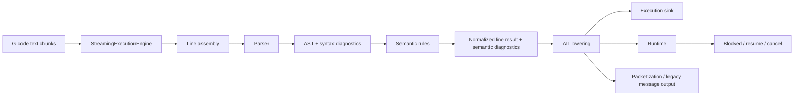

# G-code Text Flow

This page explains the end-to-end path of input G-code text through the current
library implementation and the planned streaming-first execution direction.

## End-to-End Flow

## Step 1: Accept Input Chunks

Planned primary runtime path:
- input arrives in arbitrary chunks
- engine buffers text until a complete logical line is available
- only complete lines are eligible for parse/lower/execute

Current limitation:
- current callback streaming API still parses whole input text first

## Step 2: Parse Input Text

Main code:
- `grammar/GCode.g4`
- `src/gcode_parser.cpp`
- `src/ast.h`

What happens:
- raw text is tokenized and parsed
- source positions are attached to parsed structures
- syntax diagnostics are emitted when grammar shape is invalid

Outputs:
- AST-like parse structures
- syntax diagnostics with line and column

## Step 3: Run Semantic Rules

Main code:
- `src/semantic_rules.cpp`

What happens:
- parsed lines are checked for controller-specific shape constraints
- compatibility rules and malformed forms are diagnosed
- parser output is kept, but diagnostics become more actionable

Examples:
- malformed `PROC` declaration shape
- invalid `G4` block shape
- mode conflicts in a block

Outputs:
- parse result plus semantic diagnostics

## Step 4: Lower to AIL

Main code:
- `src/ail.cpp`

What happens:
- supported constructs are converted into typed AIL instructions
- AIL is the executable intermediate representation for runtime/control-flow
- non-motion state changes are preserved as explicit instructions, not only as
  text diagnostics

Planned streaming-first direction:
- line execution may also expose normalized command objects directly to
  injected sink/runtime interfaces without requiring whole-program buffering

Examples:
- motion instructions
- `tool_select`
- `tool_change`
- `m_function`
- control-flow labels and jumps

Outputs:
- `result.instructions`
- lowering diagnostics and warnings

## Step 5: Execute Through Injected Interfaces

Planned primary runtime shape:
- engine emits deterministic execution events through an execution sink
- engine invokes runtime interfaces for slow or blocking machine work
- runtime may return immediate completion, pending/blocking, or error
- no later line executes while the current line is blocked

Examples:
- `G1` -> normalized linear-move command -> sink event -> runtime submission
- system variable read -> runtime read request -> ready/pending/error

## Step 6: Execute AIL (Current Compatibility Path)

Main code:
- `src/ail.cpp`

What happens:
- control-flow and stateful instructions are stepped in order
- policies resolve runtime decisions such as missing targets or tool-selection
  fallback behavior
- executor state tracks things like active tool, plane, rapid mode, and call
  stack state

Outputs:
- runtime state transitions
- executor diagnostics

## Step 7: Convert AIL to Packets

Main code:
- `src/packet.cpp`

What happens:
- motion-oriented AIL instructions become packets
- non-motion instructions are not emitted as motion packets
- packet output is for transport/planner-style motion consumers, not the full
  execution model

Outputs:
- packet list
- packet-stage diagnostics or skip warnings when relevant

## Step 8: Lower to Messages

Main code:
- `src/messages.cpp`

What happens:
- supported motion/dwell constructs can also be lowered into message output
- this is a separate output path from AIL packetization

Outputs:
- typed message results
- diagnostics and rejected lines

## Current Rule of Thumb

Use these modes depending on what you need:
- parse: syntax and semantic understanding
- streaming engine: planned primary execution surface
- ail: executable intermediate representation / compatibility inspection path
- packet: motion packet transport view
- lower: typed message output view for legacy integrations

## Related Docs

- [Development: Pipeline](design/pipeline.md)
- [Program Reference](../program_reference.md)
- Repo-root architecture document: `ARCHITECTURE.md`
- Repo-root specification: `SPEC.md`
